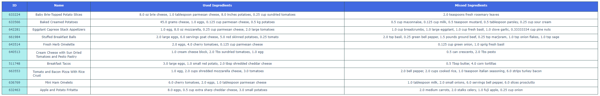
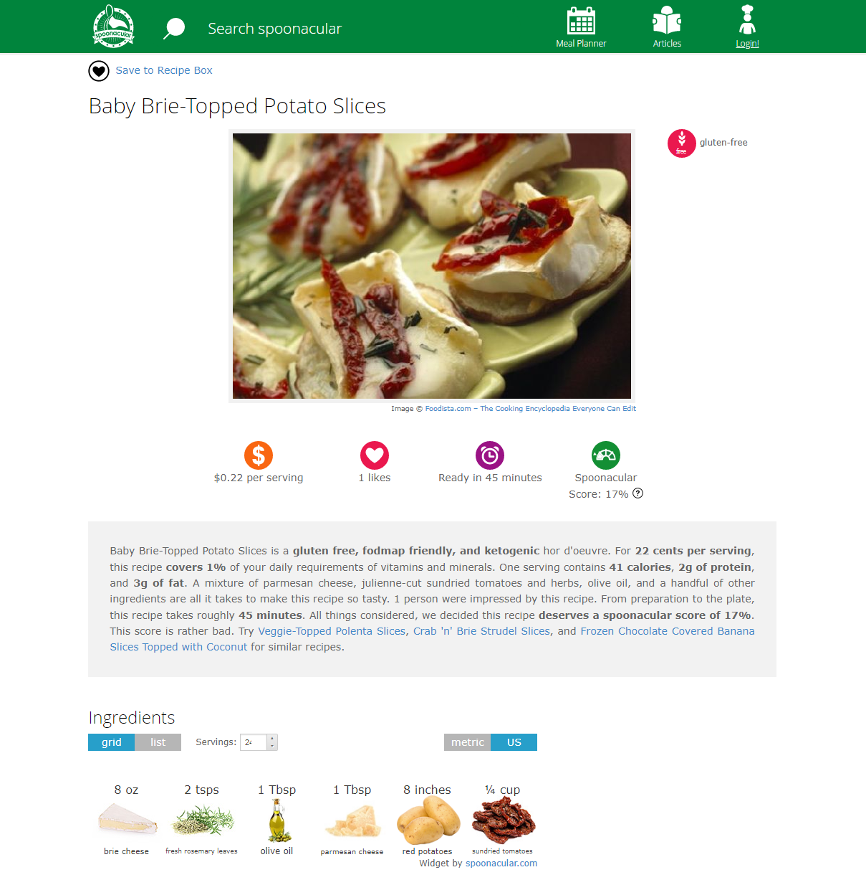
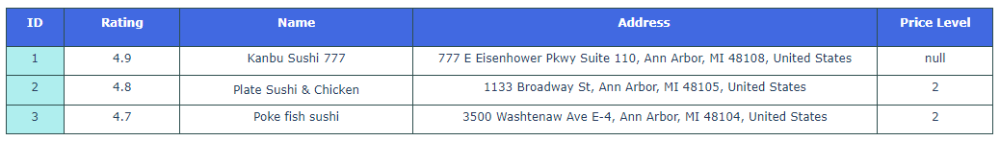
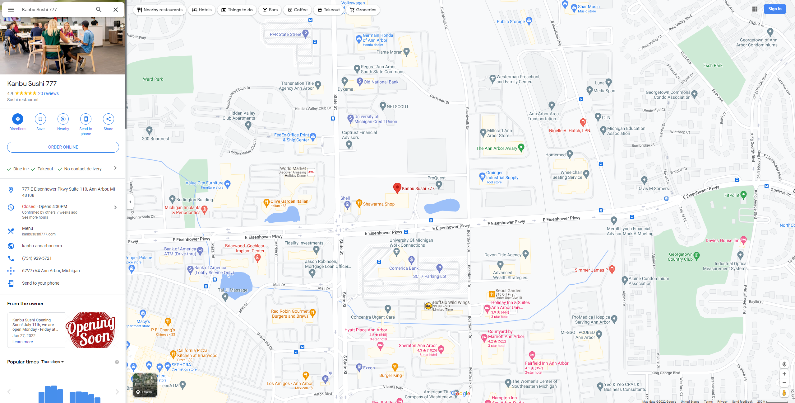

# SI507 Final Project - "What to Eat Today" APP
Highlights: Google Places API, Spoonacular API, Data Structure - Tree, Caching, Interactive Command Line Tool
## Discription
As a master's student, I always find it difficult to come up with ideas for “what to eat” in my daily life. The academic work and research tasks have already exhausted me, so I really don’t have time to think about what to eat for lunch or dinner.

As a result, I would like to build an application that can help people come up with ideas about what to eat. Users can input the ingredients that they currently have, and the system can provide them with some relative recipes (find recipes by ingredients). They have the option to see the details of those recipes that they are interested in. If they are not satisfied with any of those recipes, they also have the choice to search for nearby restaurants. The system can provide nearby restaurant information based on user's input, which will indicate the user’s preference for location, cuisine type, and rating range.

The application makes use of a tree structure to handle users' choices. All the data will be stored in the leaf node of the tree. Based on different choices, the algorithm will go into different branches of the tree and display corresponding results to the users. 

### Files
* `final.py` is the main file of this project. It contains all the necessary functions that run the program.  
* `cache.json` is the cache file that can be updated each time the users run the program. I store the cache data as a tree structure in this file.
* `read_tree.py` is an auxiliary file that contains the code for reading the tree structure in the cache file. It provides a better way of visualizing the tree.

## Prerequisites
### API Keys
* A **Google Places API** key (free): [https://spoonacular.com/food-api](https://spoonacular.com/food-api)
* A **Spoonacular API** key (free): [https://console.cloud.google.com/google/maps-apis](https://console.cloud.google.com/google/maps-apis)

When you have those two API keys, please create a `.env` file in the same folder as `final.py` and store your API keys in this format:
```
SPOONACULAR_KEY="YOURSPOONACULARKEY"
GOOGLE_MAP_KEY="YOURGOOGLEMAPKEY"
```

### Python Packages
1. requests
2. dotenv
3. plotly
4. treelib (for tree structure visualization)


## Usage
Run the `final.py` file:
```
Hi, what do you want to do today?
1. make yourself a meal
2. find a restaurant near you
Please choose 1 or 2 from the above options: 1
```
### If we choose to make a meal...

The program will ask for users to make a choice in the terminal. Here we choose to make a meal.
```
Please enter ingredients in your refrigerator (separate by comma): egg, potato, tomato, cheese
```
We enter the ingredients that we currently have. for example: `egg, potato, tomato, cheese`

Then we can see the table of recipes in our browser：
<p align="center" width="100%">
    
</p>

```
Displaying detailed results in your browser...
Please enter the recipe id that you want to know more about: 633224
```

And now we want to see the detail of recipe "Baby Brie-Topped Potato Slices" with id "633224", so we enter "633224" in the command line.

Here is the detailed recipe opened in the browser:

<p align="center" width="100%">
    
</p>

```
Open the detailed results in your browser...
Do you want to see another detailed recipe? (yes/no) no
```

The program will end by entering "no" here. If you want to see another detailed recipe, please enter yes.

### If we choose to find a restaurant...
We are going to choose the option 2 here:

```
Hi, what do you want to do today?
1. make yourself a meal
2. find a restaurant near you
Please choose 1 or 2 from the above options: 2
```
The next question is:
```
What's your current location?
0 : ann arbor
1 : lansing
2 : canton
3 : None of above
Please choose your current location from the list above: 0
```
The list above comes from the cache file. It represents a split of the tree. Searched results will be cached each time the program calls the API. If none of above is your location, choose the "None of above" option and enter your current location. Here we just go with the first choice.
```
What kind of meal do you like?
0 : japanese cuisine
1 : chinese cuisine
2 : mediterranean cuisine
3 : indian cuisine
4 : seafood restaurant
5 : None of above
Please choose your prefered cuisine type from the list above: 0
```
The cuisine type list here also comes from the cache, and this choice represents a split of the tree as well. If none of above fits your need, please choose "None of above" and enter your prefered cuisine type. We choose the first option here.
```
What rating range do you prefer?
1 : greater than 4.5
2 : 4.0 to 4.5
3 : less than 4.0
Please choose your prefered rating range from the list above: 1
```
The rating range choices here split the tree one more time. All the "japanese cuisine" restaurants in "ann arbor" are divided into three rating categories. Here we choose the first option.

<p align="center" width="100%">
    
</p>


```
Displaying results in your browser...
Which restaurant do you want to know more about? 1
```


Here we can choose one restaurant and see the its detailed webpage. Simply enter the ID of that restaurant in the terminal. Here we choose the first restaurant by entering 1.

Here is the result for "Kanbu Sushi 777":

<p align="center" width="100%">
    
</p>

The program will open a detailed webpage for that specific restaurant automatically and display:
```
Open the detailed results in your browser...
Do you want to check another restaurant's detail? (yes/no): no
Do you want to check another rating range? (yes/no): no
Do you want to search for another cuisine types? (yes/no): no
```
If you don't want to do anything, simply enter "no" for all three questions above. You can choose "yes" to any question and start over from there.

## Data Structure
In this project, I used the tree structure to store the restaurant and recipe data. I implemented the tree using a nested dictionary. All the detailed data is stored in the leaf node of the tree. for each key-value pair, the key is the parent node and the values are the child nodes. The upper tree besides the leaf nodes functions as a decision tree. The program can choose which branch to go to when it asks users for choices. 

Due to the nature of this application, the tree needs to be updated each time the users use it. As a result, I store the tree in the cache file. In this way, we don't need to explicitly reconstruct the tree each time we run the program. Once we read the cache file, the tree will be already there.

In addition, I developed a `read_tree.py` file that can provide a great visualization for the entire tree structure. Here is an example of the tree structure in the current cache file:
<details>
  <summary>Detailed Tree Structure</summary>

  ```
Root
├── Locations
│   ├── ann arbor
│   ├── canton
│   ├── detroit
│   └── lansing
├── Recipes
│   ├── Detailed Recipes
│   │   ├── Baby Brie-Topped Potato Slices
│   │   ├── Baked Corned Beef with Sauteed Cabbage and Baked New Potatoes
│   │   ├── Beef Steak With Vegetable Gravy
│   │   ├── Easy Gift Lasagna
│   │   ├── Garlic Lemon Pepper Shrimp Salad (Clean Eating)
│   │   ├── Insalata Caprese With Pesto Vinaigrette
│   │   ├── Mexican Stuffed Potatoes
│   │   ├── Pancit Bihon (Filipino Pancit)
│   │   ├── Slow Cooked Corned Beef and Cabbage
│   │   ├── Sun Dried Tomato and Herb Baked Eggs
│   │   ├── Taco Egg Roll
│   │   └── simple potato salad + bacon + onion
│   └── Searched Recipes
│       ├── bacon_chicken_onion
│       │   ├── Bacon Wrapped Filet Mignons
│       │   ├── Beef Liver With Onions and Bacon
│       │   ├── Brussels Sprouts with Bacon and Shallots
│       │   ├── Chicken Suya
│       │   ├── Harvest Hash
│       │   ├── Healthier Southern-Style Green Beans
│       │   ├── Instant Pot Black Beans
│       │   ├── Slow Cooker Rosemary Whole Chicken
│       │   ├── Southern Hoppin John
│       │   └── simple potato salad + bacon + onion
│       ├── beef_cheese_potato_tomato
│       │   ├── Baby Brie-Topped Potato Slices
│       │   ├── Baked Potato Nests
│       │   ├── Cheesy Pasta in a Pot
│       │   ├── Cottage Pie
│       │   ├── Feta Stuffed Burgers
│       │   ├── Itty Bitty Burgers
│       │   ├── Jiffy Spoon Taco Casserole
│       │   ├── Lean Shepherd's Pie
│       │   ├── Mexican Stuffed Potatoes
│       │   └── Stuffed Breakfast Balls
│       ├── beef_onion_pepper
│       │   ├── Beef Steak With Vegetable Gravy
│       │   ├── Easy Cheeseburger Casserole
│       │   ├── Entrecote Steak with Asparagus
│       │   ├── Feta Stuffed Burgers
│       │   ├── Heather's Philly Cheese Steak
│       │   ├── Homestyle Sloppy Joes
│       │   ├── Philly Cheesesteak Grilled Wraps
│       │   ├── Stuffed Pepper Casserole
│       │   ├── Venison Stew
│       │   └── Zomppa's Moroccan Meatballs
│       ├── broccoli_cheese_ground beef
│       │   ├── Broccoli with cheese soup
│       │   ├── Cauliflower and Broccoli Gratin With Camembert Cheese
│       │   ├── Copycat Panera Broccoli Cheddar Cheese Soup
│       │   ├── Farfalle With Broccoli, Carrots and Tomatoes
│       │   ├── Finger Foods: Frittata Muffins
│       │   ├── Lasagna - Using Uncooked Noodles
│       │   ├── Penne Pasta with Broccoli and Cheese
│       │   ├── Pesto Zucchini "Spaghetti
│       │   ├── Stuffed Shells with Beef and Broc
│       │   └── Taco Egg Roll
│       ├── cabbage_chicken_pork
│       │   ├── Bacon & Potato Soup, Gluten & Dairy Free
│       │   ├── Chorizo and Cheese Crostini
│       │   ├── Colcannon
│       │   ├── Donkatsu - Korean Breaded Pork Cutlet
│       │   ├── Fried Wonton
│       │   ├── Ham, Potato and Cabbage Soup
│       │   ├── Irish Colcannon
│       │   ├── Pancit Bihon (Filipino Pancit)
│       │   ├── Roasted Cabbage Wedge Salad with Yogurt Gorgonzola Dressing
│       │   └── Wintery Vegetable Beef Soup
│       ├── cabbage_corned beef
│       │   ├── Baked Corned Beef with Sauteed Cabbage and Baked New Potatoes
│       │   ├── Chorizo and Cheese Crostini
│       │   ├── Corned Beef And Cabbage With Irish Mustard Sauce
│       │   ├── Corned Beef Ribs With Brown Sugar and Mustard Glaze
│       │   ├── Corned Beef and Cabbage
│       │   ├── Fried Wonton
│       │   ├── No Mayonnaise Cole Slaw
│       │   ├── Redneck Breakfast on a Croissant
│       │   ├── Slow Cooked Corned Beef and Cabbage
│       │   └── Stir Fried Cabbage and Tomatoes
│       ├── cheese_egg_potato_tomato
│       │   ├── Apple and Potato Fritatta
│       │   ├── Baby Brie-Topped Potato Slices
│       │   ├── Baked Creamed Potatoes
│       │   ├── Breakfast Tacos
│       │   ├── Cream Cheese with Sun Dried Tomatoes and Pesto Pastry
│       │   ├── Eggplant Caprese Stack Appetizers
│       │   ├── Fresh Herb Omelette
│       │   ├── Mini Ham Omelets
│       │   ├── Stuffed Breakfast Balls
│       │   └── Tomato and Bacon Pizza With Rice Crust
│       ├── cheese_pasta
│       │   ├── Baked Ziti
│       │   ├── Baked Ziti Or Rigatoni
│       │   ├── Bird's Nest Marinara
│       │   ├── Easy Gift Lasagna
│       │   ├── Lasagne, Marietta-Style
│       │   ├── Linguine With Chick Peas and Bacon
│       │   ├── Pasta Con Pepe E Caciotta Al Tartufo
│       │   ├── Pasta Roses With Zucchini and Ham
│       │   ├── Penne with Goat Cheese and Basil
│       │   └── What to make for dinner tonight?? Bruschetta Style Pork & Pasta
│       ├── cheese_tomato
│       │   ├── Baby Brie-Topped Potato Slices
│       │   ├── Basil Infused Balsamic Oven Baked Chicken
│       │   ├── Eggplant pizzette
│       │   ├── Fresh Tomato Mozzarella Side Salad
│       │   ├── Goat Cheese Pesto Pizza
│       │   ├── Hot Cheesy Bacon Party Dip
│       │   ├── Insalata Caprese With Pesto Vinaigrette
│       │   ├── Jalapeno Queso With Goat Cheese
│       │   ├── Pasta with Raw Tomato & Lemon Infused Olive Oil
│       │   └── Tomato Stack Salad
│       ├── egg_tomato
│       │   ├── Baked Spinach, Tomato and Goat Cheese
│       │   ├── Cream Cheese with Sun Dried Tomatoes and Pesto Pastry
│       │   ├── Finger Foods: Frittata Muffins
│       │   ├── Fresh Herb Omelette
│       │   ├── Huevos Rancheros
│       │   ├── Indian-Style Eggs On Toast
│       │   ├── Mini Ham Omelets
│       │   ├── Simple Spinach and Tomato Frittata
│       │   ├── Sun Dried Tomato and Herb Baked Eggs
│       │   └── Tomato and Bacon Pizza With Rice Crust
│       └── lemon_onion_prawn
│           ├── Crab Cake Stuffed Shrimp
│           ├── Dutch Oven Paella
│           ├── Garlic Lemon Pepper Shrimp Salad (Clean Eating)
│           ├── Mixed Paella
│           ├── One Pot Meal: Shrimp Boil
│           ├── Oriental Surf and Turf - Chicken and Shrimp With Cubed Potatoes
│           ├── Paella for Four; A Wonderful Spanish Mixed Seafood Stew
│           ├── Patti's Paella
│           ├── Shrimp & Orzo
│           └── Shrimp Cakes
└── Restaurants
    ├── ann arbor
    │   ├── chinese cuisine
    │   │   ├── 4-4.5
    │   │   │   ├── China Chef
    │   │   │   ├── Evergreen Downtown
    │   │   │   ├── Hong Kong Chinese Food
    │   │   │   ├── King Shing
    │   │   │   ├── Lucky 7 Chinese Food
    │   │   │   ├── One Bowl Asian Cuisine
    │   │   │   ├── Panda Chinese & Korean Food
    │   │   │   ├── Panda House
    │   │   │   ├── TK WU Ann Arbor
    │   │   │   ├── Yee Siang Dumplings
    │   │   │   └── Ypbor Yan (Emerald City)
    │   │   ├── greater 4.5
    │   │   └── less 4
    │   │       ├── Asian Legend
    │   │       ├── Chan Garden
    │   │       ├── Chia Shiang Restaurant
    │   │       ├── Chopsticks Chinese Cuisines
    │   │       ├── Evergreen Restaurant
    │   │       ├── LAI LAI
    │   │       ├── Lucky Garden
    │   │       ├── Lucky Kitchen
    │   │       └── Panda Express
    │   ├── indian cuisine
    │   │   ├── 4-4.5
    │   │   │   ├── Aroma Indian Cuisine - Ann Arbor
    │   │   │   ├── Authentikka
    │   │   │   ├── Cardamom Restaurant
    │   │   │   ├── Curry On
    │   │   │   ├── Earthen Jar
    │   │   │   ├── Everest Sherpa Restaurant
    │   │   │   ├── India Cafe
    │   │   │   ├── Madras Masala Restaurant
    │   │   │   ├── Namaste Flavours Arbor
    │   │   │   ├── Namaste Flavours Canton
    │   │   │   ├── NeeHee's Indian Vegetarian Street Food
    │   │   │   ├── Once Upon A Grill
    │   │   │   ├── Pakwaan Fine Indian Cuisine
    │   │   │   ├── Qmin
    │   │   │   ├── Raja Rani Restaurant
    │   │   │   ├── Rao Gari Vindu Indian Cuisine
    │   │   │   ├── Shalimar Restaurant
    │   │   │   └── Taste of India Suvai
    │   │   ├── greater 4.5
    │   │   │   ├── Desi Ruchulu Indian Cuisine
    │   │   │   └── Shrimp Flavours
    │   │   └── less 4
    │   ├── japanese cuisine
    │   │   ├── 4-4.5
    │   │   │   ├── AKI SUSHI BAR AND GRILL
    │   │   │   ├── DKY Sushi
    │   │   │   ├── Godaiko
    │   │   │   ├── Ichiban
    │   │   │   ├── KANBU Sushi Downtown
    │   │   │   ├── Mama Satto
    │   │   │   ├── Miki Japanese Restaurant
    │   │   │   ├── Momo Sushi - Ann Arbor
    │   │   │   ├── Nagomi Sushi and Korean BBQ
    │   │   │   ├── Sadako Japanese Restaurant
    │   │   │   ├── Saica Restaurant
    │   │   │   ├── Slurping Turtle
    │   │   │   ├── Sushi Dabu
    │   │   │   ├── Totoro
    │   │   │   ├── UMI SUSHI
    │   │   │   └── Yotsuba Japanese Restaurant
    │   │   ├── greater 4.5
    │   │   │   ├── Kanbu Sushi 777
    │   │   │   ├── Plate Sushi & Chicken
    │   │   │   └── Poke fish sushi
    │   │   └── less 4
    │   │       └── Hibachi-San
    │   ├── mediterranean cuisine
    │   │   ├── 4-4.5
    │   │   │   ├── Ahmo's Gyros & Deli
    │   │   │   ├── Baba Dari Mediterranean Grill
    │   │   │   ├── Caspian Mediterranean Grill
    │   │   │   ├── Chef Restaurant Mediterranean Grill
    │   │   │   ├── HAIFA FALAFEL Mediterranean / middle-eastern restaurant
    │   │   │   ├── Jerusalem Garden
    │   │   │   ├── Mediterrano
    │   │   │   ├── Oasis Grill
    │   │   │   ├── Palm Palace
    │   │   │   ├── Pita Kabob Grill
    │   │   │   ├── Pita Pita
    │   │   │   ├── Pita express and Catering
    │   │   │   └── Zamaan Cafe
    │   │   ├── greater 4.5
    │   │   │   ├── Casablanca
    │   │   │   ├── El Harissa Market Cafe
    │   │   │   ├── Exotic Syrian Deli and Bakeries
    │   │   │   ├── Pita King
    │   │   │   ├── Shawarma Shop
    │   │   │   └── Shish Palace Ypsilanti
    │   │   └── less 4
    │   └── seafood restaurant
    │       ├── 4-4.5
    │       │   ├── Al's Fresh Fish & Chicken
    │       │   ├── Ann Arbor Fish & Chicken
    │       │   ├── Black Pearl
    │       │   ├── Carson's American Bistro
    │       │   ├── Crazy Crab & Noodles
    │       │   ├── Gandy Dancer
    │       │   ├── Holiday's Restaurant
    │       │   ├── Ichiban
    │       │   ├── JJ Crab House
    │       │   ├── Knight's Steakhouse
    │       │   ├── Nu Wave Fish and Chicken
    │       │   ├── Real Seafood Company
    │       │   ├── Red Lobster
    │       │   ├── Weber's Restaurant
    │       │   └── Wicked Mary's Chicken
    │       ├── greater 4.5
    │       │   ├── Bobs Fish & Chicken
    │       │   ├── Mo P's Chicken & Fish
    │       │   ├── Monahan's Seafood Market Inc
    │       │   ├── Poke fish sushi
    │       │   └── Shrimp Flavours
    │       └── less 4
    ├── canton
    │   └── japanese cuisine
    │       ├── 4-4.5
    │       │   ├── 888 Sushi
    │       │   ├── Aji Ten Japanese Restaurant
    │       │   ├── Kabuki Sushi
    │       │   ├── Mali Thai Cuisine & Sushi
    │       │   ├── O'Sushi Novi Korean BBQ
    │       │   ├── Sapporo Hibachi Steakhouse And Sushi
    │       │   ├── Saya Sushi
    │       │   ├── Sushi & Rolls
    │       │   └── Yotsuba Japanese Restaurant
    │       ├── greater 4.5
    │       │   ├── Aki sushi and Thai
    │       │   ├── Izakaya Sanpei Restaurant
    │       │   ├── Koji
    │       │   ├── Matsu Chan Restaurant
    │       │   ├── New York Sushi
    │       │   ├── So Moon Bowl and Sushi
    │       │   └── Sumo Japanese Grill
    │       └── less 4
    │           ├── Ichiban Hibachi Steakhouse & Sushi Bar
    │           ├── O'Sushi Japanese Restaurant
    │           └── Sora Japanese Cuisine & Sushi Bar
    ├── detroit
    │   └── japanese cuisine
    │       ├── 4-4.5
    │       │   ├── Fat Salmon Sushi
    │       │   ├── Ima Izakaya
    │       │   ├── Koi 🍣 Sushi 🍣 Japanese 🍿 Restaurant
    │       │   ├── Kona Sushi - Walkerville
    │       │   ├── Maru Sushi & Grill
    │       │   ├── Niko Sushi
    │       │   ├── Oishii Sushi
    │       │   ├── The California Sushi
    │       │   ├── Wasabi Korean & Japanese Restaurant
    │       │   └── ima
    │       ├── greater 4.5
    │       │   ├── AJI SUSHI Windsor
    │       │   ├── Bash Original Izakaya
    │       │   ├── Hikari Restaurant
    │       │   ├── Koja Sushi
    │       │   ├── Marukin Restaurant Inc
    │       │   ├── Orient Restaurant-Japanese Grill
    │       │   ├── Sakura Hibachi Grill
    │       │   └── the Dragonfly Sushi Bar
    │       └── less 4
    │           ├── Taka Japanese Sushi and Thai Food Restaurant
    │           └── Tenko Sushi
    └── lansing
        └── janpanese cuisine
            ├── 4-4.5
            │   ├── AI Fusion Sushi & Grill
            │   ├── AnQi Sushi Express
            │   ├── Hibachi Grill Sushi Buffet
            │   ├── Korea House Restaurant
            │   ├── Maru Sushi & Grill
            │   ├── Ohana Sushi and Bar
            │   ├── Omi Sushi
            │   ├── Sansu Sushi and Cocktails
            │   ├── Sapporo Ramen & Noodle Bar
            │   ├── Ukai Hibachi Grill & Sushi Bar
            │   ├── Ukai Hibachi Grill & Sushi Bar Woodlake
            │   └── Yum Japan
            ├── greater 4.5
            │   ├── Bento Kitchen Cravings
            │   ├── Mi Sushi & Noodles
            │   ├── Mikado Sushi & Grill
            │   ├── Sushi Moto
            │   ├── Udon Sushi Restaurant
            │   ├── YumYum Bento
            │   └── Zhen Ramen & Grill
            └── less 4
                └── Hibachi House
  ```

</details>
